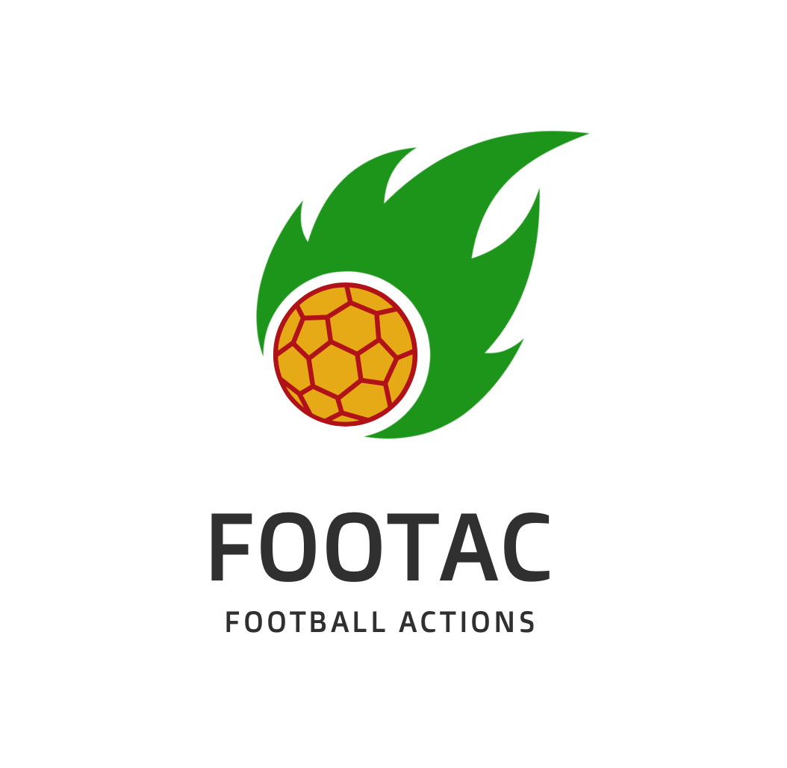

# Footac.com

    

[https://www.footac.com](https://www.footac.com)

## About The Project

### Introduction
Footac is a web app for football coaches, football analysts, players, fans or video editors who need direct and fast 
access to any specific football actions of the team. At the moment it is available only in Czech language.

*  Personalised access for clubs.
* No free data for public without permission. Sensitive club data are visible only for club members.
* Club members can participate on editing data ( add player to action)

### Filtering actions
After login to the app you choose any team of your club and see all the actions of recorded games.

Available  filters:
* 14 action type (goals, fouls, shots , throw ins ...)
* played games
* my team / opponents team
* on attacking / defending half
* player who made the action(made a foul, pass a ball, made a shot...)
* player who was passive in the action(foul was made on him , received a pass, he was GK by opponents shot...)

### Footac Gamepad
This project wouldn't be possible without second part of my project called Footac Gamepad. 
I can use Xbox Controller to tag and save events from football game. 
To find out more visit [Footac Gamepad on Github](https://github.com/OndrejPech/footac-gamepad).

## Demo log-in

Username: pan  
Password: burinka25  

The data are only accessible after you log in. If your account is associate with a football club, you can log in and see all the data of your club.
For testing / informational purposes please use credentials above. 
This is a demo account, so you can play around. Please don't change password so other testers can use the same login.

## Roadmap / Issues

- [ ] re-organize User-Account system
- [ ] create different Roles and Permissions
- [ ] let users choose time-frames for each action type
- [ ] DB Collation in Czech language(not possible on this DB server)
- [ ] move to python 3.11
- [ ] responsive design for mobile phones

In the future you can see the [open issues](https://github.com/OndrejPech/Footac/issues) for a full list of proposed features and known issues.

## Contributing
This is my first project to learn basic web development practices. Any advice, critic or improvement is more than welcome.
I am trying to focus on base functionality.

Visual side of the website is not my main goal at the moment since I am not planning to be front-end developer. I am using bootstrap at the moment in not very efficient way.

If you have a suggestion that would improve this project, you can either fork the repo and create a pull request or even better 
contact me directly to discuss our cooperation. 

I am also looking for long term mentor (even paid) to help me improve this project.

## Contact

Ondrej Pech - pech.ondrej@gmail.com

Project Link: [https://www.footac.com](https://www.footac.com)
